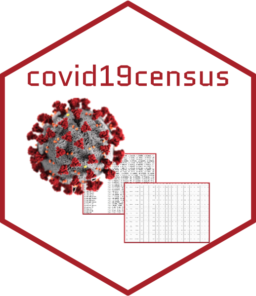

<!-- README.md is generated from README.Rmd. Please edit that file -->

```{r, include = FALSE}
knitr::opts_chunk$set(
  collapse = TRUE,
  comment = "#>",
  fig.path = "man/figures/README-",
  out.width = "100%"
)
```

# covid19census  

<!-- badges: start -->

[](https://codecov.io/gh/c1au6i0/covid19census?branch=master)
[](https://travis-ci.com/c1au6i0/covid19census)
[](https://codecov.io/gh/c1au6i0/covid19census?branch=master)

<!-- badges: end -->

## Overview

The package `covid19census` provides functions to extract COVID-19 cases, deaths, hospitalizations and test of U.S. and Italy at the county and regional level, respectively, and then combines them with other population metrics (age, sex, prevalence of chronic conditions, income indexes, access to health services and many others).

*Note that the package has not been made by and is not part of the covid19.census.gov website.*

## Installation

Download the package in a local folder and then run the following code.

```{r intallation, eval=FALSE, include=TRUE}
devtools::install_local("path_to_package")
```

Alternatively, you can install it directly from github.

```{r intallation2, eval=FALSE, include=TRUE}
library(devtools)

devtools::install_github("c1au6i0/covid19census")
```

## Usage

A dataset that includes COVID-19 data and **all the other demographic variables** can be obtained executing `getus_all` (get-U.S-all) to get U.S data, or `getit_all` (get-Italy-all) to get Italy data.

```{r all, message=FALSE, eval=FALSE}
library(covid19census)

# to retrieve u.s data you can use 
# the new york times or john hopkins university repository f
all_us <- getus_all(repo = "jhu")

# to retrieve italy data
all_it <- getit_all()
```

Details on the other functions and the datasets can be found in the vignette of the package `vignette("v_covid19census")`.

## U.S. Datasets and Sources

Data regarding COVID-19 number of cases and deaths (at the county level) can be obtained from the [New York Time](https://github.com/nytimes/covid-19-data) or the [Johns Hopkins University](https://github.com/CSSEGISandData), whereas number of tests and hospitalizations from the [the Covid Tracking Project](https://covidtracking.com/api}).

The other datsets were obtained from the [Homeland Infrastructure Foundation](https://hifld-geoplatform.opendata.arcgis.com/datasets/hospitals/data?page=18), the [Census](https://data.census.gov/cedsci/table?q=United%20States), [Mapping Medicare Disparities](https://data.cms.gov/mapping-medicare-disparities), and [activity indexes](https://github.com/COVIDExposureIndices/COVIDExposureIndices) calculated by  Victor Couture, Jonathan Dingel, Allison Green, Jessie Handbury, and Kevin Williams based on smartphone movement data provided by `PlaceIQ`. Emissions of pm2.5 in micro g/m3 (2016) were reported by \href{http://fizz.phys.dal.ca/~atmos/martin/?page_id=140#V4.NA.02.MAPLE}{Atmoshpheric Composition Analysis Group} and
#'  aggregate by \href{https://github.com/wxwx1993/PM_COVID/blob/master/additional_preprocessing_code/download_pm25_values.md}{Ista Zahn and Ben Sabath}

This is a list of U.S. datasets that can be accessed directly or in a `dataframe` containing also COVID-19 metrics:

* `us_acm_househ`: several metric regarding household composition, including poverty, education, ancestry (2018).
* `us_age_sex`: age and sex distribution (2018).
* `us_fl65`:  percentage of fee-for-service (FFS) Medicare enrollees that had an annual flu vaccination (2017)
* `us_hospbeds`: total hospital beds in each county (2019).
* `us_netinc`: median househould income (2018).
* `us_mmd`: data of 2017 regarding the  prevalence found in medicare beneficiaries of 
    * many medical and chronic conditions (Alzheimer, chronic kidney, obesity, depression, obstructive pulmonary, disease, arthritis, diabetes, osteoporosis, asthma, atrial  fibrillation, ischemic hearth, myocardial infarction, hypertension).
    * several type of cancer.
    * emergency,  medical admissions and annual visits.
    * pneumoccocal vaccine.
    * tobacco use.
* `us_pm2.5`: Emissions of pm2.5 in micro g/m3
* `us_race`: estimated races in population (2018).
    
*Note that* info for some counties are missing in some datasets. For example, `hospbeds` contains info on 2545 counties, `fl65` has 3224 counties, whereas datasets from the Census have 3220.

## Italy: Datasets and Sources

Data regarding COVID-19 deaths, confirmed cases, test and hospitalizations are extracted from the [Protezione Civile repository](https://github.com/pcm-dpc/COVID-19)

Demographic metrics and other stats regarding medical conditions and vaccinations were obtained from the [ISTAT](http://dati.istat.it/?lang=en), [Ministero della Salute](http://www.salute.gov.it/portale/home.html). Data regarding `pm2.5` were collected by [Istituto Superiore per la Protezione Ambientale](https://annuario.isprambiente.it/pon/basic/14)


This is a list of Italy datasets that can be accessed directly or in a `dataframe` containing also COVID-19 metrics:

* `it_bweight`: Body mass index in regions of Italy, in the general population.
* `it_cancer`: Number of cancer patients in each region by type.
* `it_chronic`: Number of people suffering of chronic conditions by region and type.
* `it_dem`: Number of people by region, sex, age.
* `it_firstaid`: Number of people using first aid or medical guard (3 months). 
* `it_fl`: Influenza vaccination coverage in Italy for 2009-2019 season for general population and aged 65 and more.
* `it_fl_2019`: Influenza vaccination coverage in Italy for 2018-2019 season for general population and 65 and more.
* `it_hospbed`: Inpatient hospital beds per 1000 people.
* `it_house`:  household crowding index from 2014 to 2018 in each region.
* `it_netinc`:  median net annual households income (including imputed rents, in euros).
* `it_pm2.5`:  emission of particulate 2.5 in tons per region.
* `it_regions`: Area in square meters of each region. Used to calculate density per region.
* `it_smoking`: Number of people aged 14 years and over that self-referred as smoker, non smoker, or past smoker by region.

## Raw Data and other Scripts

Raw data and the code used to import it can be found in the [data-raw](https://github.com/c1au6i0/covid19census/tree/master/data-raw) folder. 


## Terms of Use

Refer to the [License](https://github.com/c1au6i0/covid19census/blob/master/LICENSE.md) for details on the terms of use and copyrights.


